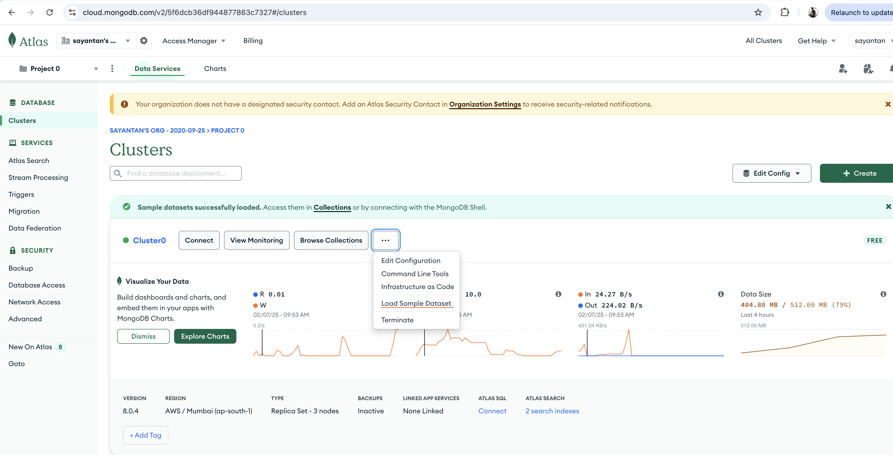

# Mongo Cluster Setup

1. Create a free cluster from https://cloud.mongodb.com
2. Create user and pass ( sayantanscs / <db_password> ) Connection URL mongodb+srv://<db_user>:<db_password>@<cluster_path>
3. Load sample data "sample_airbnb" for test https://www.mongodb.com/docs/atlas/sample-data/ 

### Alternative : Run mongo locally in docker 
docker run --name mongodb -d -p 27017:27017 mongodb/mongodb-community-server:$MONGODB_VERSION

acess via api : mongodb://localhost:27017

Download sample_airbnb and load it manually 

