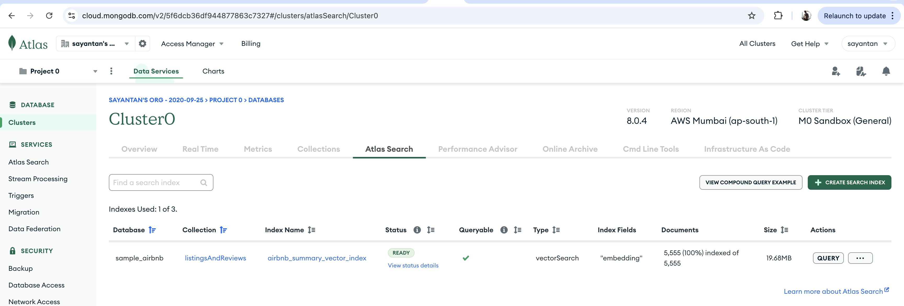

# Vector searh demo  

#### Node version used : v22.12.0 

#### Install dependencies : 
npm ci

#### Steps to build index and perform search

step (i)  : generate embeddings and insert into original documents , run ts-node insert_embeddings_into_doc.ts  

step (ii) :  create vector indexes in mongo from original document's embeddings, run ts-node build_vector_index.ts. Once index are build you can verify same in cluster.

step (iii) : perform a similarity search , run ts-node vector_demo_playground.ts, please set your search text in variable searchText.

### References 

Vector embeddings : https://www.datastax.com/blog/how-to-create-vector-embeddings-in-node-js 

Vector DB : https://www.mongodb.com/resources/basics/databases/vector-databases

@xenova/transformers : https://www.npmjs.com/package/@xenova/transformers

Mongo vector search : https://www.mongodb.com/docs/atlas/atlas-vector-search/tutorials/vector-search-quick-start/?tck=ai_as_web